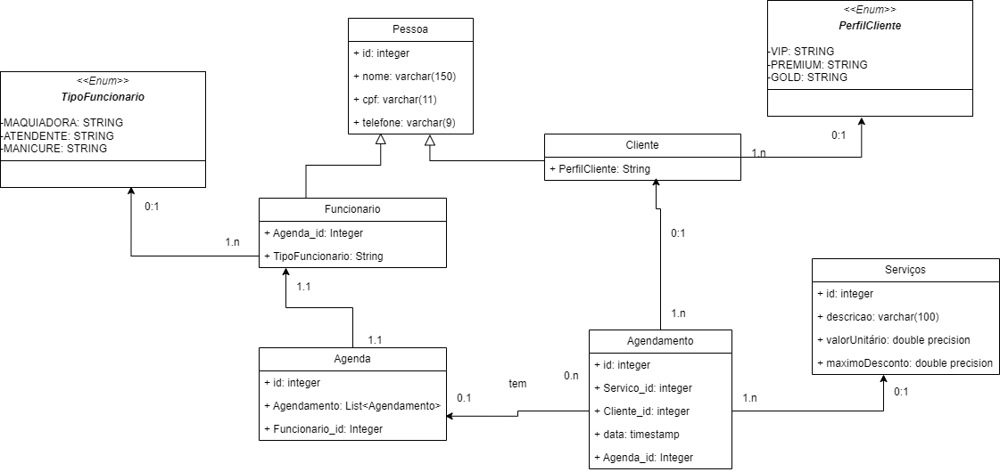

# ProjetoLPOOE1_GabrieliGranjaBrandalise
Este repositório destina-se exclusivamente para envio do trabalho de LPOO.

Este projeto é um sistema de agendamento de horários para um salão de beleza.
O projeto tem um menu com 3 opções: 
-Cadastro: Funcionario, Cliente, Serviço.
-Agendamento: Agendar, aqui pode-se cadastrar um agendamento.
-Agenda: Escolher Agenda, aqui pode escolher a agenda de qualquer funcionário para ver os agendamentos para cada agenda.

