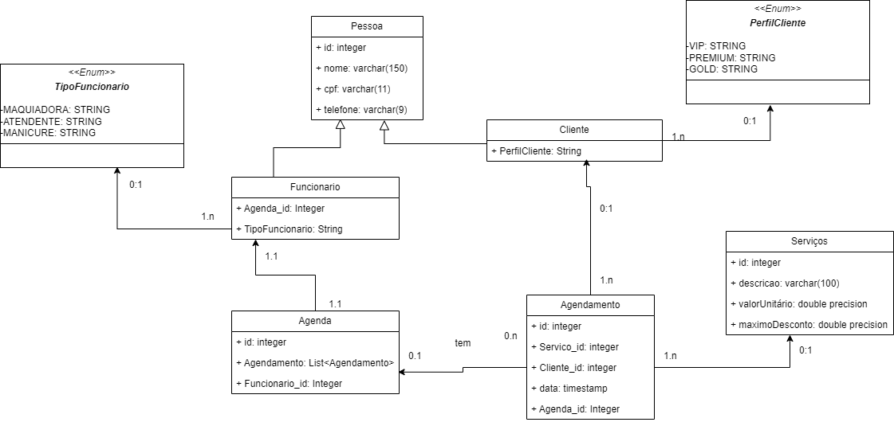

# ProjetoLPOOE1_GabrieliGranjaBrandalise
Este repositório destina-se exclusivamente para envio do trabalho de LPOO.

Este projeto é um sistema de agendamento de horários para um salão de beleza.

link do diagrama UML:[ https://drive.google.com/file/d/1E79OUsk-a97jdAQk2moeqfS1jeK0Dt8S/view?usp=sharing](https://drive.google.com/file/d/18hRzF2kxxB4f2M7JP6-AT2GWmFCQzWpe/view?usp=sharing)
